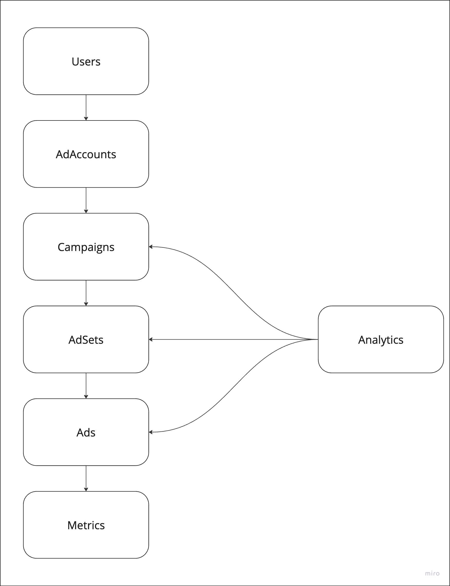

# **RFC: Beginner Project**

## **Status**  
*In Review*

## **Authors**  
- Mihir Khandekar
- GitHub Co-Pilot

## **Created**
_[2024-12-02]_  

## **Problem Statement**  

Build bare-bones Clarisights that supports Facebook Ads and Google Analytics.

## **Proposed Solution**  
We will be building a Rails application that helps us achieve the following requirements:

1. Allows a user to login and see his/her tabular data of Facebook ads.
2. The user should be able to do group-by and aggregate queries on any set of dimensions and metrics. The dimensions are predefined. The metrics are also the base metrics only. User should be able to change dates and see data for that relevant period.
3. User should be able to view their analytics data.
3. Write tests.

## **Technical Design**  

### **Data Models**  

<details>
<summary><strong>User</strong></summary>

- **Fields**:
  - `id` (primary key, UUID or integer)
  - `email` (string)
  - `encrypted_password` (string, provided by Devise)

- **Relationships**:
  - Users can be associated with one or more ad accounts if multi-user support is needed.

</details>

<details>
<summary><strong>AdAccount</strong></summary>

- **Fields**:
  - `id` (primary key, UUID or integer)
  - `name` (string)
  - `user_id` (foreign key)

- **Relationships**:
  - Belongs to a User.
  - Has many Campaigns.

</details>

<details>
<summary><strong>Campaign</strong></summary>

- **Fields**:
  - `id` (primary key, UUID or integer)
  - `name` (string)
  - `objective` (string)
  - `start_date` (date)
  - `end_date` (date)
  - `daily_budget` (integer)
  - `lifetime_budget` (integer)
  - `buying_type` (string)
  - `ad_account_id` (foreign key)

- **Relationships**:
  - Belongs to an AdAccount.
  - Has many AdSets.

</details>

<details>
<summary><strong>AdSet</strong></summary>

- **Fields**:
  - `id` (primary key, UUID or integer)
  - `name` (string)
  - `optimization_goal` (string)
  - `start_date` (date)
  - `end_date` (date)
  - `daily_budget` (integer)
  - `lifetime_budget` (integer)
  - `billing_event` (string)
  - `bid_strategy` (string)
  - `campaign_id` (foreign key)

- **Relationships**:
  - Belongs to a Campaign.
  - Has many Ads.

</details>

<details>
<summary><strong>Ad</strong></summary>

- **Fields**:
  - `id` (primary key, UUID or integer)
  - `name` (string)
  - `landing_pages` (string)
  - `ad_type` (string)
  - `ad_format` (string)
  - `start_date` (date)
  - `facebook_post` (string)
  - `instagram_post` (string)
  - `ad_set_id` (foreign key)

- **Relationships**:
  - Belongs to an AdSet.
  - Has many Metrics.

</details>

<details>
<summary><strong>Metric</strong></summary>

- **Fields**:
  - `id` (primary key)
  - `ad_id` (foreign key)
  - `date` (date)
  - `impressions` (integer)
  - `all_clicks` (integer)
  - `clicks` (integer)
  - `spend` (integer)
  - `all_ctr` (float)
  - `ctr` (float)
  - `cplc` (float)
  - `cpc` (float)
  - `comments` (integer)
  - `likes` (integer)
  - `spend` (integer)
  - `landing_page_views` (integer)
  - `mobile_app_installs` (integer)
  - `video_plays` (integer)
  - `conversions` (integer)
  - Other ad metrics as needed.

- **Relationships**:
  - Belongs to an Ad.

</details>

<details>
<summary><strong>AnalyticsData</strong></summary>

- **Fields**:
  - `id` (primary key)
  - `campaign_name` (string)
  - `adset_name` (string)
  - `ad_name` (string)
  - `revenue` (integer)
  - `date` (date)

- **Relationships**:
  - Belongs to a Campaign, AdSet, and Ad.

</details>

---

**ER Diagram**
<br />


#### Query Patterns

1. **Get Total Impressions by Campaign**
  ```sql
  SELECT 
    c.name AS campaign_name, 
    SUM(m.impressions) AS total_impressions
  FROM metrics m
  JOIN ads a ON m.ad_id = a.id
  JOIN adsets s ON a.ad_set_id = s.id
  JOIN campaigns c ON s.campaign_id = c.id
  JOIN ad_accounts ac ON c.ad_account_id = ac.id
  WHERE c.name = {campaign_name}
    AND m.date BETWEEN {start_date} AND {end_date}
  GROUP BY c.name;
  ```

2. **Get Spend by AdSet for a Specific Campaign**
```sql
SELECT
  s.name AS adset_name,
  SUM(m.spend) AS total_spend
FROM metrics m
JOIN ads a ON m.ad_id = a.id
JOIN adsets s ON a.ad_set_id = s.id
JOIN campaigns c ON s.campaign_id = c.id
JOIN ad_accounts ac ON c.ad_account_id = ac.id
WHERE c.name = {campaign_name}
  AND m.date BETWEEN {start_date} AND {end_date}
GROUP BY s.name;
```

3. **Get Revenue by ad for an ad account**
// here we will have to join analytics data by campaign_name, ad set name and ad name
```sql
SELECT
  a.name AS ad_name,
  SUM(ad.revenue) AS total_revenue
FROM analytics_data ad
WHERE ad.campaign_name = {campaign_name}
  AND ad.date BETWEEN {start_date} AND {end_date}
GROUP BY a.name;
```

### **APIs**  

`POST /login`
- Request: `{ email: ' ', password: ' ' }`
- Response: `{ token: ' ' }`
   
`GET /accounts` (optional)
- Request Headers : `{ token: ' ' }`
- Response: `{ accounts: [ { id: ' ', name: ' ' } ] }`
- `GET /metrics`

### **System Architecture**  

#### Components
1. Postgres DB
2. Rails API
3. Some async job processor or CRON job for fetching data from Facebook and Google APIs
4. Rails views for the frontend

System Architecture Diagram (Conceptual Representation)
```
+-----------------+        +-----------------+        +-----------------+
|                 |        |                 |        |                 |
|  Facebook API   |        |  Google API     |        |  Rails API      |
|                 |        |                 |        |                 |
+--------+--------+        +--------+--------+        +--------+--------+
         |                          |                          |
         |                          |                          |
         |                          |                          |
         +--------------------------+--------------------------+
         |                          |                          |
         |                          |                          |
         |                          |                          |
+--------+--------+        +--------+--------+        +--------+--------+
|                 |        |                 |        |                 |
|  Postgres DB    |        |  Async Job      |        |  Rails Views    |
|                 |        |  Processor      |        |                 |
+-----------------+        +-----------------+        +-----------------+
```

## **Implementation Plan**  

**Stage 1**: Design and review

**Stage 2**: Development and testing  

**Stage 3**: Deployment  

